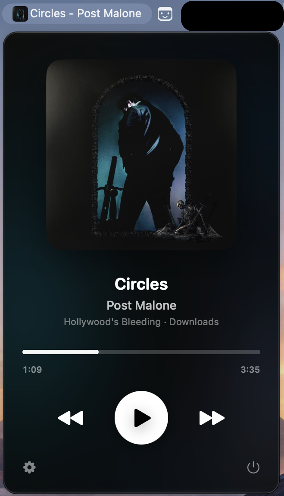
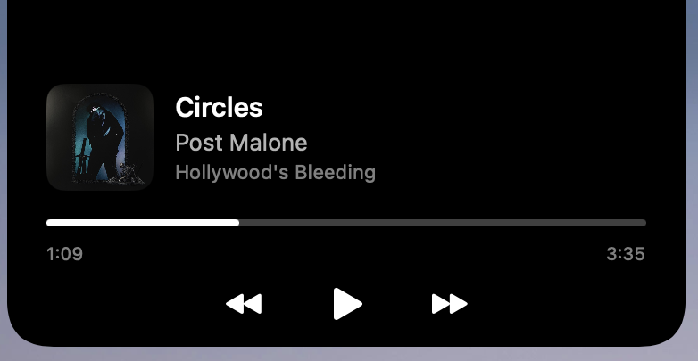

# MusicControl

**See what's playing and control your music, right from your menu bar and your MacBook's notch.**

MusicControl is a small, free Mac app that sits quietly at the top of your screen. Glance up to see the song, click to open a beautiful player, or hover over the notch for a quick mini player. No windows to juggle, no switching apps.

<table>
  <tr>
    <td align="center" valign="top">
      <br>
      <sub><b>The menu bar player</b></sub>
    </td>
    <td align="center" valign="top">
      <br>
      <sub><b>The notch mini player</b></sub>
    </td>
  </tr>
</table>

## What it does

- **Always know what's playing.** The album cover and song name can sit right in your menu bar.
- **A beautiful player in one click.** Big album art, song details, a progress bar, and play, pause and skip buttons. The colours change to match each album.
- **Hover over the notch.** Move your cursor to the notch and a mini player slides out. Move away and it disappears.
- **Jump anywhere in a song.** Click or drag the progress bar to skip to any point.
- **Make it yours.** Turn the album cover, song name or notch player on or off whenever you like. MusicControl remembers your choices.

## Works with

| Music app | Status |
| --- | --- |
| Apple Music | Ready |
| Spotify | Coming soon |
| YouTube Music | Coming soon |

## What you need

- A Mac running **macOS 14 (Sonoma) or newer**
- The **Apple Music** app
- For the notch player: a MacBook with a notch. Everything else works on any Mac.

## How to install

**1. Download**
Go to the [Releases page](../../releases), and download **MusicControl.zip** from the latest release.

**2. Unzip and move it**
Double-click the downloaded file to unzip it. Then drag **MusicControl** into your **Applications** folder.

**3. Open it for the first time**
Double-click MusicControl in Applications. macOS will show a message saying it can't open the app. This is normal for apps that don't come from the App Store. Here's how to allow it:

1. Click **Done** (or **OK**) on the message.
2. Open **System Settings** and click **Privacy & Security** in the sidebar.
3. Scroll down to the **Security** section. You'll see a message about MusicControl being blocked.
4. Click **Open Anyway** and enter your password or Touch ID.
5. Click **Open** when asked to confirm.

You only need to do this once.

**4. Allow it to control Music**
macOS will ask if MusicControl can control **Music**. Click **OK**. MusicControl needs this to see the current song and press play, pause and skip for you. It doesn't collect or send any of your information anywhere.

**5. Play a song and look up**
Start a song in Apple Music. You'll see a small music note in your menu bar. Click it to open the player.

## How to use it

- **Click the menu bar icon** to open the player.
- **Click the gear** at the bottom left of the player to choose what appears in your menu bar and to turn the notch player on or off.
- **Hover over the notch** for the mini player. Click the progress bar to skip around in the song.
- **Click the power button** at the bottom right of the player to quit.

## Something not working?

**It says "Nothing playing" but music is playing**
MusicControl may not have permission yet.
1. Open **System Settings > Privacy & Security > Automation**.
2. Find **MusicControl** and make sure the switch next to **Music** is on.
3. If MusicControl isn't in the list, quit it, open it again, and click **OK** when asked about controlling Music.

**macOS says the app is "damaged" and can't be opened**
This is a safety message macOS shows for downloaded apps, and the app isn't actually damaged. To fix it:
1. Open the **Terminal** app (press Command+Space, type Terminal, press Return).
2. Copy and paste this line, then press Return:
   ```
   xattr -cr /Applications/MusicControl.app
   ```
3. Open MusicControl again.

**I can't see the menu bar icon**
On MacBooks with a notch, icons that don't fit are hidden behind it. Quit one or two other menu bar apps, or hold **Command** and drag icons you don't need out of the menu bar, to make room.

**The notch player doesn't appear**
Open the player, click the gear, and make sure **Notch display** is on. The notch player needs a MacBook with a notch.

**The song name takes too much space in my menu bar**
Open the gear menu and turn off **Song name in menu bar**. You can keep just the album cover or the icon.

## Questions

**Is it free?**
Yes.

**Does it collect any information about me?**
No. MusicControl only talks to the Music app on your own Mac. It doesn't use the internet and doesn't collect or share anything.

**Will it work with Spotify or YouTube Music?**
Not yet, but they're next on the list. Watch this page for updates.

**Why does macOS warn me when I open it?**
The app isn't sold through the App Store, so macOS asks you to confirm it. The installation steps above show you how.

## Feedback and bug reports

Found a problem or have an idea? [Open an issue](../../issues) and tell us what happened, what you expected, and which Mac and macOS version you're using. Screenshots help a lot.

## For developers

Want to build it yourself or contribute? See [DEVELOPING.md](DEVELOPING.md).
